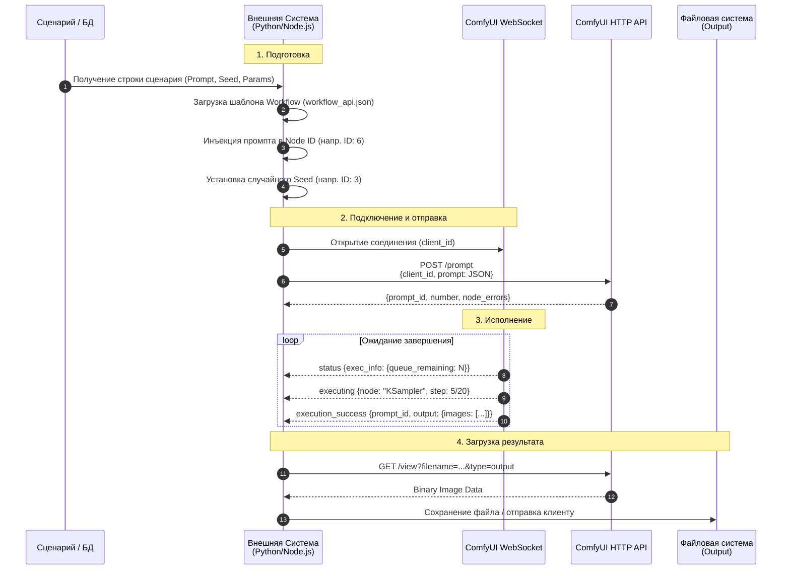
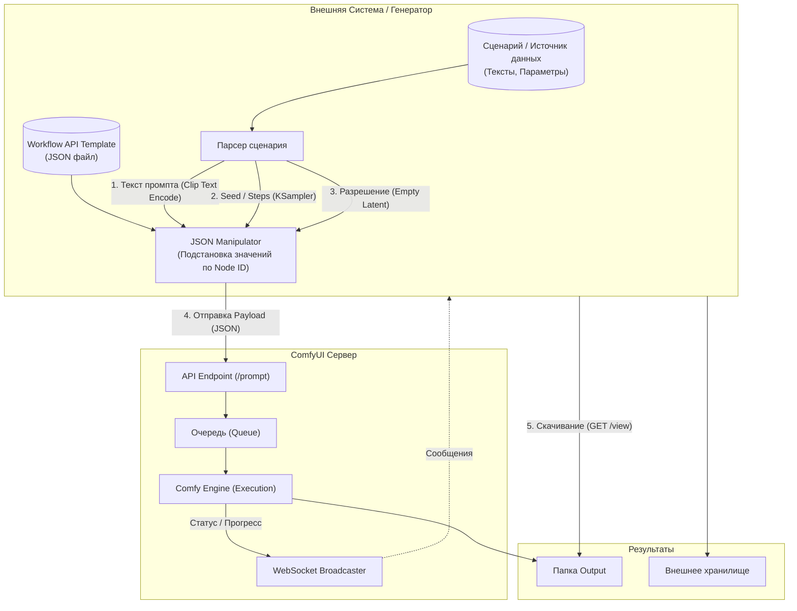

# Комfy-UI-Orchestrator

Решение для оркестрации и автоматизации ComfyUI с помощью внешних систем.

## Описание

Для реализации такой задачи обычно используется API ComfyUI (HTTP + WebSocket). Внешняя система выступает в роли **оркестратора**, который берёт сценарий, подставляет данные в JSON-шаблон воркфлоу (workflow) и отправляет его на генерацию.

Ниже представлены две схемы: **Sequence Diagram** (показывает последовательность взаимодействия) и **Flowchart** (показывает архитектуру потока данных).

---

## 1. Sequence Diagram: Процесс взаимодействия

Эта диаграмма показывает, как внешняя система пошагово общается с ComfyUI.



---

## 2. Architecture Flowchart: Структура данных

Эта диаграмма показывает, как данные трансформируются из текста сценария в готовое изображение через модификацию JSON.



---

## Ключевые технические моменты для реализации

Если вы планируете это программировать, вот что важно знать (что отражено на схемах):

### 📋 Формат Workflow (API vs Standard)
ComfyUI имеет два формата JSON. Стандартный (который вы сохраняете кнопкой Save) содержит метаданные UI (позиции узлов).

Для внешней системы вам нужен API Format. В ComfyUI включите в настройках «Enable Dev mode Options», тогда появится кнопка «Save (API Format)». Именно этот JSON ожидает эндпоинт `/prompt`.

### 🔢 Адресация узлов (Node IDs)
Внешняя система не знает, что такое «Positive Prompt». Она знает только Node ID.

Вам нужно заранее знать, что, например, узел с `"id": "6"` — это текст промпта, а узел `"3"` — это KSampler. Ваша система должна менять значения внутри inputs этих конкретных ID.

### 🔗 Синхронизация через WebSocket
HTTP запрос на `/prompt` возвращает ответ мгновенно (что задача поставлена в очередь).

Чтобы узнать, когда картинка готова, обязательно нужно слушать WebSocket. Ищите сообщение типа `executing` (текущий узел) и `execution_success` (завершение).

### 📥 Загрузка изображений

ComfyUI не возвращает картинку в теле ответа WebSocket или HTTP POST.

Он возвращает имя файла.

Вам нужно сделать отдельный GET запрос: 
```
http://host:8188/view?filename=Image_001.png&subfolder=&type=output
```